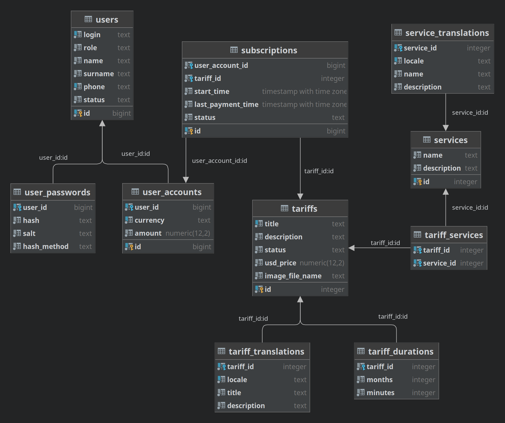

# provider
Provider Java web application

_**(Internet) Provider** is an organization that provides services for accessing, using, or participating in the 
Internet; this specific provider may also provide **any other kind of services imaginable, such as TV, mobile network 
and so on**._

## Technologies used
* Java 17
* Maven
* Jakarta Servlet API 5.0; Tomcat 10
* PostgreSQL
* Junit 5
* Mockito
* Log4j2 + slf4j
* Bootstrap 5
* MVC design

**OOP principles and patterns** are widely used in this project.

Design patterns used:
* Front Controller
* Command
* Template Method
* Abstract Factory
* Factory Method
* DAO
* Service Layer
* PRG
* and so on

## Domain specifics

1. The User is provided with a list of Services (Telephone, Internet, Cable TV, IP-TV,etc.) and a list of Tariffs. 
2. Tariff includes at least one Service, has certain rate and duration. **Once created, it can never be deleted, 
may be hidden instead**
3. Tariff list supports:
   * sorting
     * alphabetically(a-z, z-a)
     * by price
   * filtering by Services included
   * pagination
4. Tariff data may be downloaded as PDF
5. The User can choose and Subscribe to one or more services at a certain rate
6. Subscription includes Tariff and payment time data
7. The User has an Account they can replenish. 
8. Funds are withdrawn from the account by the system depending on the User Subscriptions
   * If the amount in the Account is not enough, the system shows the User the message about it
   (and imaginary stops supplying unpaid Subscriptions Service(s)).
   * The required amount is withdrawn automatically after the user replenishes their Account
   (this means Subscription Services are now supplied again)
9. Supported User roles:
   1) GUEST - unauthorized user; no permissions
   2) MEMBER - authorized user; has an Account, may replenish it; may authorize and buy subscriptions
   3) ADMIN - manages users, services and tariffs:
      * may register Users of _MEMBER_ role
      * may ban and unban Users of _MEMBER_ role
      * may create Services
      * may create Tariffs
      * may update Tariffs
      * may hide Tariffs
   4) ROOT - has _ADMIN_ rights + manages Users of _ADMIN_ role:
      * may create Users of _ADMIN_ role
      * may block and unblock Users of _ADMIN_ role

## Deployment
What one needs to deploy and start using this app

_If any of the context init parameter names(specified in the DD) you need is not listed here, just take a look
at the DD, it's pretty obvious_

### Environment
#### Servlet Container
Servlet Container required: **Tomcat 10+**(Jakarta Servlet API 5 support required)

Application should be deployed according to used Servlet Container rules: both .war and simply compiled classes 
approach may be chosen

#### RDBMS Server
PostgreSQL version used during development: 14.5

Before running the app, PostgreSQL server should be started and app database with its tables should be created
1. Create project db(default name: provider)
2. Change project db name in /src/main/webapp/WEB-INF/context.xml if needed
3. Open created db and run PostgreSQL db creation script /sql/postgres/create_db.sql

### Files uploading
Upload path - directory for files uploading path; all the uploaded files will be place under this dir
* To upload files(tariff images), file upload path must be specified in the DD
* **File upload path must be outside the project directory**
* File upload path DD context init parameter name: 'fileUploadDir'(for example: /home/provider/upload)
  * **Application process needs read, write and execute(rwx) permissions on this dir**
* Application automatically creates subdirectories it needs(for example 'images' dir)

### Default locale
Default locale is specified in the DD(set to 'en')

### Default user timezone
Default user timezone is specified in the DD(set to 'GMT+2')

### Locate properties file
Locale properties file - properties file that contains (locale, user friendly language title) pairs

Locale properties file path is specified in the DD(context init param name: localesPropertiesFilePath)

## Architecture and design specifics
### General
* MVC architecture is applied.
* Front Controller pattern is applied along with Command pattern, so there is only one Servlet per app
* Commands use Services. Services use DAOs and other Services

### Database structure
Relations:
* User : UserPassword - 1:1
* User : UserAccount - 1:1
* UserAccount : Subscription - 1:M
* Subscription : Tariff M:1
* Tariff : Service - M:M

#### Database scheme

### Command classes
* Command instances are obtained via factory instance
* FrontCommand abstract class is a base class for all command classes
* Command hierarchy controls user authorization
  * UserAccessCommand overrides execute() method and adds methods for authentication control
  * MemberCommand abstract class is a base class for commands that may be executed by any authorized User
  * AdminCommand abstract class is a base class for commands that may be executed by Users of _ADMIN_ role  
  or higher(_ROOT_)

### DAO
* All DAO classes extend EntityDao
* DAO instances **obtain Connection from the calling code**, so setConnection() method must always be called before 
calling DB methods
* DAO instances **NEVER close Connection**, it must be closed(returned to pool) by the calling code

#### Testing
Dao testing is implemented using test database with the structure similar to the production one.
Test db is created using project db tables creation script(/sql/postgres/create_db.sql)

